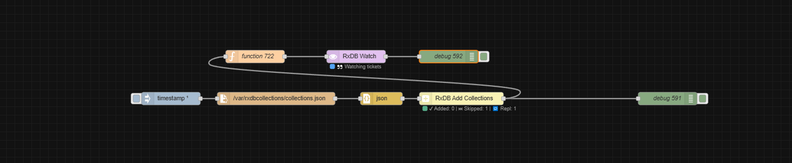

# node-red-contrib-rxdb

 

A custom Node-RED node set for building low-code, reactive database flows using [RxDB](https://rxdb.info/) backed by **MongoDB**.

---

## 🚀 Overview

This package includes Node-RED nodes that:

- Dynamically manage RxDB collections and schemas at runtime  
- Support reading, writing, watching, and replicating changes  
- Use MongoDB as a durable, developer-friendly backend  
- Allow full flow-based control — no static schemas required!

---

## 📦 Included Nodes

| Node                   | Purpose                                       |
|------------------------|-----------------------------------------------|
| `rxdb-read`            | Query documents from one or more collections |
| `rxdb-write`           | Insert documents into a collection            |
| `rxdb-watch`           | Stream real-time changes from a collection   |
| `rxdb-add-collections` | Dynamically add collections + enable replication |

---

## 🧰 Prerequisites

To use this project with MongoDB:

### ✅ 1. Install MongoDB via Docker

If Docker is not already installed, follow instructions from [https://docs.docker.com/get-docker/](https://docs.docker.com/get-docker/)

Then pull and run a MongoDB container:

```bash
docker pull mongo
docker run --name mongodb -d -p 27017:27017 -v /var/lib/mongodb:/data/db --restart always mongo
```

### ✅ 2. Create an Admin User

Enter the Mongo shell:

```bash
docker exec -it mongodb mongosh
```

Then set up authentication:

```javascript
use admin
db.createUser({
  user: "your_username",
  pwd: "your_password",
  roles: [{ role: "root", db: "admin" }]
})
exit
```

### ✅ 3. Restart with Auth Enabled

```bash
docker stop mongodb
docker rm mongodb
docker run --name mongodb -d -p 27017:27017 -v /var/lib/mongodb:/data/db --restart always mongo mongod --auth
```

---

## 🚠 Installation

From local directory:

```bash
cd ~/.node-red
npm install /path/to/node-red-contrib-rxdb
```

Then restart Node-RED:

```bash
node-red-restart
```

---

## 🔧 Node Usage

### 🟢 `rxdb-read`

Reads one or more collections:

```json
{
  "rxdb": {
    "collections": ["tickets"],
    "limit": 10
  }
}
```

### ✏️ `rxdb-write`

Writes a document to a collection:

```json
{
  "rxdb": { "collection": "tickets" },
  "payload": {
    "id": "t-001",
    "subject": "Test ticket"
  }
}
```

### 👀 `rxdb-watch`

Watches a collection for live updates:

```json
{
  "rxdb": { "collection": "tickets" }
}
```

Output:

```json
{
  "payload": {
    "event": "INSERT",
    "doc": { ... }
  }
}
```

### 🛠️ `rxdb-add-collections`

Dynamically register collections:

```json
{
  "calendarEvents": {
    "schema": { ... },
    "replicate": true,
    "replicationUrl": "https://myhost/tickets/0"
  }
}
```

---

## 📚 Features

- 🐒 MongoDB support via RxDB adapters
- 🧩 Dynamic schema injection at runtime
- 📡 Replication support (RxDB replication-server plugin)
- 🧠 Smart instance caching (one shared RxDB connection)
- 🛠 No external DB config nodes — flow-driven logic only

---



---

## 📄 License

**UNLICENSED**  
No warranties. No attribution required. No restrictions.

